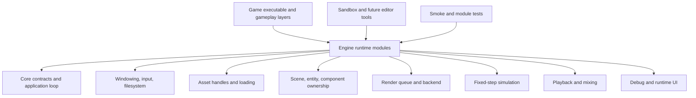
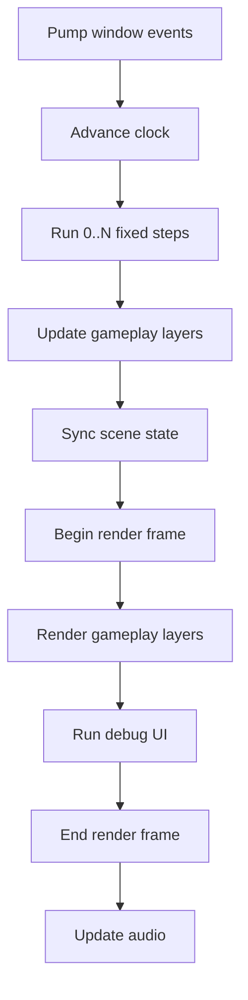

# Architecture

This document is the main map of the project.

The most important idea is simple:

> The engine owns runtime infrastructure.  
> The game owns gameplay rules.  
> Tools inspect or assist the runtime.  
> Tests defend the contracts between them.

## 1. Layered Model

Rules:

1. `Game/` may depend on engine modules, but engine modules may not depend on `Game/`.
2. `Tools/` may depend on engine modules, but shipping runtime code may not depend on `Tools/`.
3. The application loop in `Core/` talks to other modules through service interfaces, not concrete implementations.
4. Gameplay code should not call graphics API code directly.
5. Scene state is the source of truth for the game world.

## 2. Runtime Ownership Model

The runtime is built around three ideas:

### Application

`Application` is the orchestrator. It owns:

- the main loop
- the fixed/update tick split
- the layer stack
- the lifetime order of engine services

It does **not** own gameplay rules, rendering policy, or scene contents directly.

### Runtime Services

The application talks to the engine through `RuntimeServices`.

That struct contains interfaces for:

- window / platform
- assets
- scene
- renderer
- physics
- audio
- UI

This is important because it keeps the loop stable even while implementations change. Today the renderer is a bootstrap placeholder. Later it can become an OpenGL renderer without forcing the rest of the runtime to be rewritten.

### Layers

Gameplay is plugged into the application through `Layer`.

Layers are the primary extension point for:

- gameplay systems
- menus
- overlays
- debug views
- sandbox experiments

The current layer lifecycle is:

1. `OnAttach`
2. `OnFixedUpdate`
3. `OnUpdate`
4. `OnRender`
5. `OnUi`
6. `OnDetach`

This gives a very understandable flow and keeps the game loop readable.

## 3. Planned Module Responsibilities

### Core

Owns fundamental contracts:

- `Application`
- `AppClock`
- `Layer` and `LayerStack`
- `RuntimeServices`
- logging and shared value types

Core is intentionally lightweight. It should remain the most stable module in the repository.

### Platform

Owns the operating-system-facing layer:

- window creation
- event pumping
- input
- filesystem adapters
- timing hooks when needed

Current phase uses a null bootstrap implementation. Later we expect `SDL3`.

### Assets

Owns asset identity and lifetime:

- asset handles
- logical names
- source paths
- future import settings and cache metadata

Gameplay code should request assets by logical identity, not by opening arbitrary files everywhere.

### Scene

Owns the game world model:

- active scene
- entity creation
- components
- transform hierarchy

The bootstrap implementation is intentionally simple. The long-term plan is to move to `EnTT` while keeping the same architectural role.

### Renderer

Owns frame submission and backend execution:

- frame begin/end
- scene submission
- future sprite batching
- future camera and render pass organization

The key rule: gameplay should describe what needs to be rendered, not how GPU commands are issued.

### Physics

Owns deterministic fixed-step simulation.

The main architectural rule is:

> physics advances only during fixed update

This is why the application clock and the physics interface are coupled through the fixed timestep path.

### Audio

Owns playback services, buses, and future mixing.

For now it is a placeholder service. The future backend is planned around `miniaudio`.

### UI

Owns debugging overlays and, later, runtime HUD support.

The long-term direction is:

- `Dear ImGui` for debug tools
- a lightweight game-facing HUD layer for shipping UI

## 4. Frame Flow

This order is deliberate:

- input and platform events come first
- physics consumes fixed steps before frame update
- scene updates happen before render submission
- renderer and UI stay late in the frame

## 5. Dependency Rules

These rules are the practical backbone of the codebase.

### Allowed

- `Game -> Engine::*`
- `Tools -> Engine::*`
- `Tests -> Engine::*`
- `Renderer -> Core`
- `Scene -> Core`
- `Assets -> Core`
- `Platform -> Core`

### Not Allowed

- `Engine -> Game`
- `Core -> Platform concrete implementations`
- `Renderer -> Game`
- `Physics -> Renderer`
- `Assets -> Game`

If a new feature seems to require a forbidden dependency, the design should be revisited.

## 6. How Features Should Land

When adding a gameplay feature:

1. Add or update the data shape in `Scene/` or `Game/Data/`
2. Add engine-facing contracts if needed
3. Implement the runtime system in the appropriate engine module
4. Use a gameplay layer in `Game/` to express the rule
5. Add a smoke test if the new feature changes engine contracts

When adding a new engine subsystem:

1. Start with the interface in `Core/RuntimeServices`
2. Put the concrete implementation in the correct module
3. Wire the implementation from the executable entry point
4. Document the module contract in this file and `docs/TECH_STACK.md`

## 7. Phase Plan

### Phase 1: Runtime Spine

- application loop
- service contracts
- bootstrap implementations
- architecture documentation

### Phase 2: Real 2D Runtime

- SDL3 window/input
- OpenGL renderer
- texture loading
- cameras and sprite batching

### Phase 3: World and Gameplay

- EnTT scene model
- Box2D integration
- animation
- prefabs and scenes from YAML

### Phase 4: Production Features

- debug tools
- asset hot reload
- save/load
- polished game loop for the first small game

