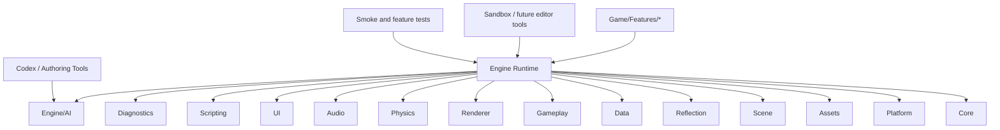
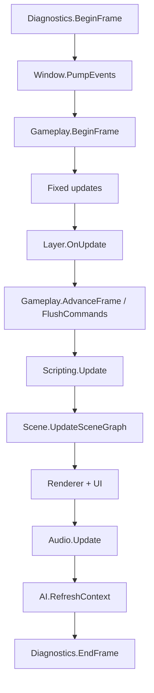

# Architecture

This repository now targets an AI-native 2D engine architecture.

The core idea is:

> The engine should be understandable by humans and Codex through stable
> service contracts, schema-first data, feature metadata, and frame-level
> diagnostics.

## 1. Layered Model



## 2. Ownership Rules

1. `Game/Features/*` depends on engine services, not concrete middleware APIs.
2. `Engine/Core` owns sequencing, not gameplay rules.
3. `Engine/Gameplay` owns events, commands, and timers.
4. `Engine/Data` owns schema contracts for gameplay-authored data.
5. `Engine/Reflection` owns metadata that describes engine and feature types.
6. `Engine/AI` exports authoring context; it does not directly mutate gameplay.
7. `Engine/Diagnostics` records what happened in a frame so tooling can reason
   about failures.

## 3. Runtime Services

The application loop talks to the rest of the engine through
[RuntimeServices.hpp](../Engine/Core/Include/SHE/Core/RuntimeServices.hpp).

Current services:

- `IWindowService`
- `IAssetService`
- `ISceneService`
- `IReflectionService`
- `IDataService`
- `IGameplayService`
- `IRendererService`
- `IPhysicsService`
- `IAudioService`
- `IUiService`
- `IScriptingService`
- `IDiagnosticsService`
- `IAIService`

This is the backbone of the architecture. When a subsystem is added later, the
first question is whether it needs to be a runtime service or a feature module.

## 4. AI-Native Modules

### Reflection

Files:

- [ReflectionService.hpp](../Engine/Reflection/Include/SHE/Reflection/ReflectionService.hpp)
- [ReflectionService.cpp](../Engine/Reflection/Source/ReflectionService.cpp)

Purpose:

- register types
- register feature modules
- build a human/AI-readable catalog

### Data

Files:

- [DataService.hpp](../Engine/Data/Include/SHE/Data/DataService.hpp)
- [DataService.cpp](../Engine/Data/Source/DataService.cpp)

Purpose:

- register gameplay schemas
- describe required fields
- become the future home of YAML validation

### Gameplay

Files:

- [CommandBuffer.hpp](../Engine/Gameplay/Include/SHE/Gameplay/CommandBuffer.hpp)
- [TimerService.hpp](../Engine/Gameplay/Include/SHE/Gameplay/TimerService.hpp)
- [GameplayService.hpp](../Engine/Gameplay/Include/SHE/Gameplay/GameplayService.hpp)

Purpose:

- centralize gameplay commands
- centralize timed events
- provide a single digest of frame-level gameplay activity

### Scripting

Files:

- [ScriptingService.hpp](../Engine/Scripting/Include/SHE/Scripting/ScriptingService.hpp)

Purpose:

- stable host boundary for future Lua integration
- catalog script modules for Codex context export

### Diagnostics

Files:

- [DiagnosticsService.hpp](../Engine/Diagnostics/Include/SHE/Diagnostics/DiagnosticsService.hpp)

Purpose:

- record per-frame phase traces
- make failures explainable and reviewable

### AI

Files:

- [AuthoringAiService.hpp](../Engine/AI/Include/SHE/AI/AuthoringAiService.hpp)
- [AuthoringAiService.cpp](../Engine/AI/Source/AuthoringAiService.cpp)

Purpose:

- export a stable authoring context
- summarize the active scene, schemas, features, scripts, and diagnostics

## 5. Gameplay Feature Shape

Gameplay no longer wants to grow as a flat `Game/Source` directory.

Preferred layout:

```text
Game/Features/<FeatureName>/
  <FeatureName>Layer.hpp
  <FeatureName>Layer.cpp
  Data/
    <feature>.schema.yml
  Tests/
    <FeatureName>Tests.cpp
  README.md
```

The bootstrap example lives at:

- [BootstrapFeatureLayer.hpp](../Game/Features/Bootstrap/BootstrapFeatureLayer.hpp)
- [BootstrapFeatureLayer.cpp](../Game/Features/Bootstrap/BootstrapFeatureLayer.cpp)

## 6. Frame Flow



## 7. Dependency Rules

Allowed:

- `Game/Features -> Engine::*`
- `Tools -> Engine::*`
- `Tests -> Engine::*`
- `AI -> Reflection/Data/Gameplay/Diagnostics contracts`

Not allowed:

- `Engine -> Game`
- `Gameplay -> Renderer`
- `AI -> direct gameplay mutation`
- `Data -> Game-specific code`

## 8. Why This Helps Codex

Codex performs best when the project is:

- small-surface and explicit
- rich in local contracts
- organized by feature boundaries
- backed by data schemas
- able to explain its current runtime story

That is exactly what the current refactor is trying to enforce.
